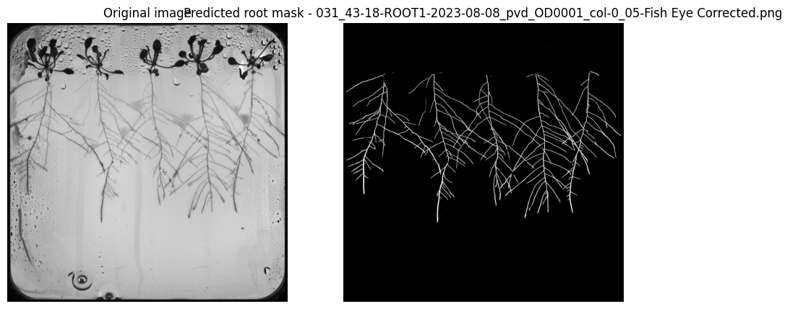

# Semantic segmentation (Deep Learning) - 

# Root
---
## Relevant information:

Over the course of the project many root models were built. The following information refers to "root_4.h5" which is the model that performed better in the computer vision pipeline

### Training plots 

The plots can also be found as html files 

#### **Training and validation Loss**

#### **Training and validation IOU**

---

### Performance metrics

On the test set the model to identify the root model attained the following metrics:

- Test Loss: 0.006946456618607044

- Test Accuracy: 0.9973463416099548

- Test F1 Score: 0.8191097974777222

- Test IoU: 0.9028586745262146
---
---

### Error analysis

Despite the model's performance metrics, visually analysing the model's predictions gives some important insights:

- the model's output correctly segments the root plants, but also identifies some noise (water drops, scratches...) along the petri dish as roots
  
- The model correctly identifies the roots, in cases where the shoot is overlapping it does not identify the shoot as root which might be at first sight confused with model's error/mistake

In the end of the jupyter notebook, it's possible to observe all of the model's predictions on the test set

 

 

