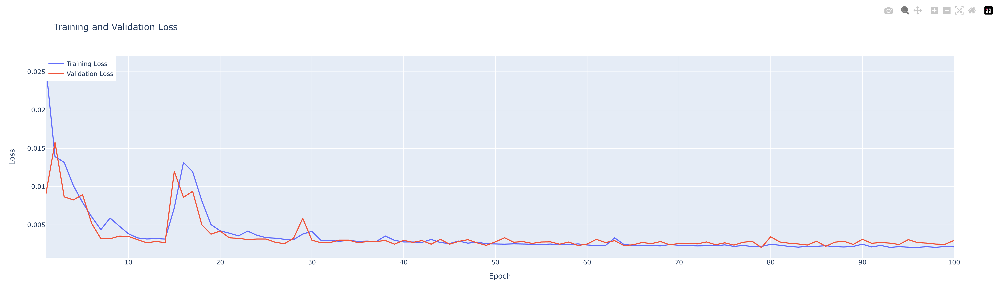
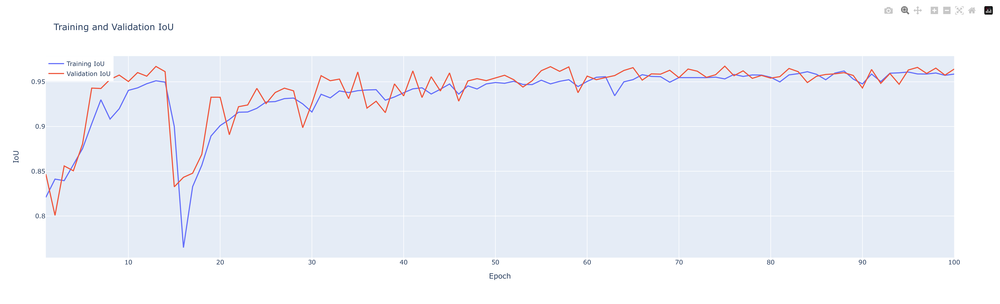
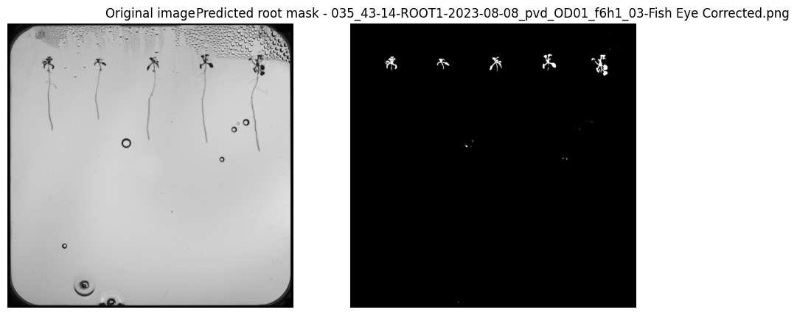
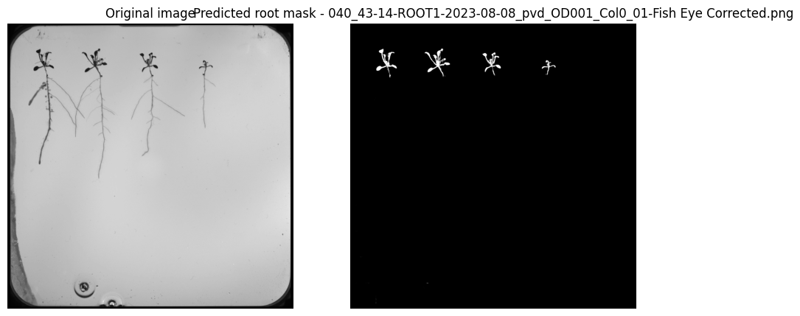

# Semantic segmentation (Deep Learning) - 

# Shoot

---
## Relevant information:

### Training plots 

The plots can also be found as html files 

#### **Training and validation Loss**

#### **Training and validation IOU**

---

### Performance metrics

On the test set the model to identify the background attained the following metrics:

- Test Loss: 0.0033225403167307377

- Test Accuracy: 0.9988816380500793

- Test F1 Score: 0.6885848045349121
- Test IoU: 0.9424681067466736
---
---

### Error analysis

Despite the model's performance metrics, visually analysing the model's predictions gives some important insights:

- the model appears to be identifying the shoot very well, however it is also capturing some noise (drops of water) as shoot

In the end of the jupyter notebook, before the plot of the labels for the occluded root class, it's possible to observe all of the model's predictions on the test set

 

