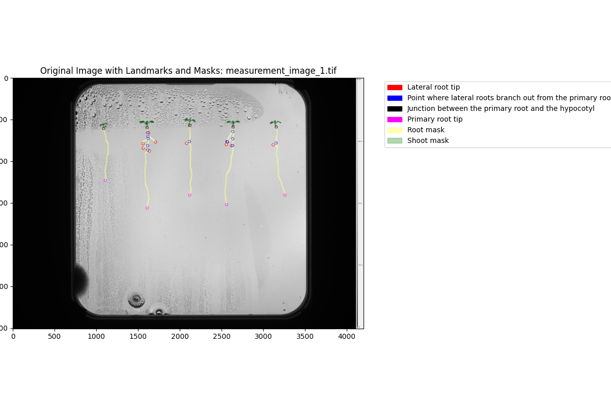

# The Computer Vision Pipeline: Arabidopsis Analyser
---

## Objective of this Pipeline

Using the `arabidopsis-analyser.ipynb`, you can process a folder of images and obtain the following for each image:

---

### 1. Root and Shoot Masks

---

### 2. Plant Landmark Locations

---

### 3. A Combined Image

---

Additionally, two CSV files are generated with the primary root and total lateral root lengths in pixels, along with another CSV file containing the landmark location coordinates.

You can find examples of this pipeline's output in the **processed_images** folder.

---

Using the `interactive-image-plots.ipynb`, you can generate an interactive plot that combines all the aforementioned outputs:

### Interactive Plot

---

For demonstration, a zipped folder `measurement_set.rar` is included, containing two sample images to test the pipeline, unfortunately it wasn't possible to uploade them unzipped due to github's file size limit.

If you'd like to download an example of the interactive plot, you can do so [here](https://edubuas-my.sharepoint.com/:u:/g/personal/220387_buas_nl/EbDralAE5o5Nid4-PizwuD8BfyikUIj6cJo2r83uwVnqeg?e=hEuQoY), or take a closer look at the gif above located in the **media** folder.

Both `arabidopsis-analyser.ipynb` and `interactive-image-plots.ipynb` contain detailed instructions on how to use the provided functions.
