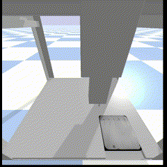

# 2. Use a PID controller system 

## What is a PID Controller? 

A PID controller is like a smart system that helps the robot (in our case the robotic simulation of OT-2 Digital Twin) move to the right position. It constantly checks where the robot is compared to where it should be and makes small adjustments to get it to the exact spot.


## An example of how the PID controller looks like in action:



## Code Documentation

The code used to setup the simulation and inoculation with the PID controller can be found in `PID_controller.ipynb`

### Environment Initialization

```python
import gymnasium as gym
import numpy as np
import time
from simple_pid import PID
import matplotlib.pyplot as plt
from ot2_gym_wrapper import OT2Env
from pipeline import landmarks

# Instantiate the OT2 robot environment with visual rendering
env = OT2Env(render='human')
```


### Environment Reset

The environment is reset to its initial state, providing the first observation and additional environment info.


```python
observation, info = env.reset()
```

### Image Processing for Goal Positioning

An image of the plate is captured, processed to extract landmarks (e.g., root tips), which are then used to define goal positions for the robot's movements.

```python
image_path = env.get_plate_image()
coordinates = landmarks(image_path)
```

### Conversion Factor Calculation

The script calculates a conversion factor from pixels to meters, facilitating the accurate positioning of the robot in physical space.

```python
plate_size_m = 0.15
plate_size_pixels = 2804
conversion_factor = plate_size_m / plate_size_pixels
```

### PID Controllers Initialization


PID controllers for the X, Y, and Z axes are initialized with predefined gains to manage the robot's precise movements.

```python
pid_x = PID(Kp=16.0, Ki=0, Kd=0)
pid_y = PID(Kp=16.0, Ki=0, Kd=0)
pid_z = PID(Kp=16.0, Ki=0, Kd=0)

offset_x = 0.10775
offset_y = 0.088
goal_pos_z = 0.1695
```

### Goal Position Adjustment and Movement
The script adjusts the goal positions based on the conversion factor and moves the robot towards these goals using the PID controllers. Coordinates are converted from pixel measurements to meters, and adjusted positions are calculated to guide the robot accurately.

```python
# Empty list to hold adjusted coordinates
goal_positions = []

# Loop through each dictionary in the coordinates list
for coord in coordinates:
    # Extract the primary_root_tip tuple
    original_position = coord["primary_root_tip"]
    # Adjust the tuple values by multiplying with the conversion factor and round the results
    adjusted_position = (original_position[1] * conversion_factor, original_position[0] * conversion_factor)
    # Append the adjusted coordinate tuple to the goal_positions list
    goal_positions.append(adjusted_position)

# Print the resulting list of adjusted positions
print(goal_positions)
```
### PID Control Execution

A function `run_pid_to_goal` is defined to execute the PID control loop, guiding the robot to each target position. This includes plotting the distance to the goal over time to visualize the robot's approach, and adjusting the robot's actions based on the PID controller's output to reach the desired location with precise movements.

```python
# Function to calculate Euclidean distance between two 3D points
def calculate_distance(point1, point2):
    return np.linalg.norm(np.array(point1) - np.array(point2))

# Modified function to run PID control and plot distance over steps
def run_pid_to_goal(goal_pos_x, goal_pos_y, goal_pos_z, observation):
    # PID setpoints are defined
    pid_x.setpoint = goal_pos_x
    pid_y.setpoint = goal_pos_y
    pid_z.setpoint = goal_pos_z
    
    distances = []  # List to store distances at each step
    
    # Loop to move towards the goal position and perform actions
    for i in range(5000): 
        # Robot's current position is updated
        position_x, position_y, position_z = observation[:3]
        
        # PID controllers calculate the required actions
        action_x = pid_x(position_x)
        action_y = pid_y(position_y)
        action_z = pid_z(position_z)
        
        action = [action_x, action_y, action_z]
        
        # The robot performs the calculated actions
        observation, reward, terminated, truncated, info = env.step(action)
        
        # Distance to the goal is calculated and stored
        current_distance = calculate_distance((position_x, position_y, position_z), (goal_pos_x, goal_pos_y, goal_pos_z))
        distances.append(current_distance)
        
        # Check if the robot has reached the goal
        if current_distance < threshold:
            # Perform inoculation or other actions as required
            break

    # Plotting the distance to goal over steps
    plt.figure(figsize=(10, 6))
    plt.plot(distances, label='Distance to Goal')
    plt.xlabel('Step')
    plt.ylabel('Distance in meters')
    plt.title('Distance to Goal Over Steps')
    plt.legend()
    plt.grid(True)
    plt.show()
```

### Looping Through Goal Positions

The robot is guided through each goal position in a loop, utilizing the `run_pid_to_goal` function for precise control towards each target. This showcases the practical application of PID control in a robotics context.

```python
# Loop through each goal position in the list
for idx, goal_pos in enumerate(goal_positions, 1):  # Start index at 1 for more natural numbering
    print(f'\n\nPlant {idx}:\n')
    
    goal_pos_y = offset_y + goal_pos[1]  # Apply the Y offset to the goal position
    goal_pos_x = offset_x + goal_pos[0]  # Apply the X offset to the goal position
    
    # Call the function to run PID control for the current goal position
    run_pid_to_goal(goal_pos_x, goal_pos_y, goal_pos_z, observation)
```

This process iterates through each identified goal position, applying necessary offsets and utilizing PID control to navigate the robot precisely to each target location. The method demonstrates the integration of image processing for goal identification, PID control for movement precision, and structured loops for task automation.