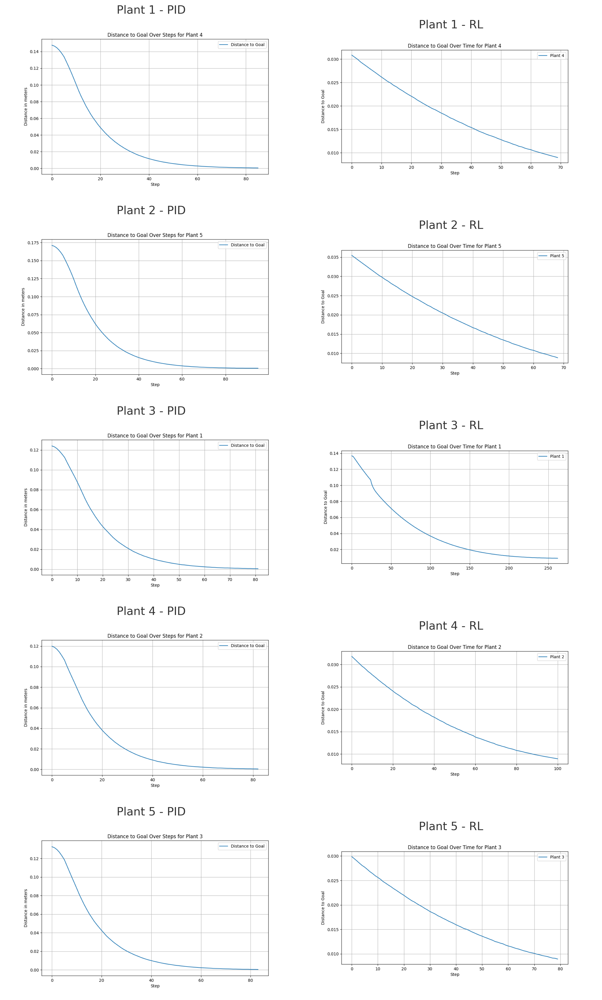

# 4. Comparing the PID and RL controllers
---

Let's analyse the time in seconds and error in meters for the PID and RL controllers

| plant | error_PID  | error_RL  | time_PID | time_RL  |
|-------|------------|-----------|----------|----------|
| 1     | 0.000486606 | 0.00899532 | 0.723148 | 2.50483  |
| 2     | 0.0004134   | 0.0089358  | 0.701229 | 0.872136 |
| 3     | 0.000452126 | 0.00893085 | 0.713755 | 0.73981  |
| 4     | 0.000470191 | 0.00898842 | 0.820398 | 0.659379 |
| 5     | 0.000489754 | 0.00885039 | 1.07848  | 0.845987 |

<br>




### Conclusion:
PID consistently produces lower error values compared to RL, indicating better precision. On the other hand, RL tends to perform faster in some cases (e.g., Plant 4 and Plant 5) but at the cost of higher errors. Depending on the task requirements, PID is preferable for precision, while RL can offer faster results with a trade-off in accuracy. For PID the error was always inferior to 1 milimeter and for RL the error was always infereior to 10 milimeters


## Code Documentation

The code used to setup this comparison can be found in `RL_vs_PID_controller.ipynb`. 

### Dependencies

The code utilizes several libraries for its operations:

- `stable_baselines3` for the RL model.
- `ot2_gym_wrapper` for a custom environment that simulates the robotic arm's movements.
- `matplotlib` for plotting the results.
- `simple_pid` for the PID control.
- `pandas` and `numpy` for data handling and calculations.
- `time` and `os` for timing executions and handling file paths.

### Execution Flow

1. **Environment Initialization:** A custom environment, `OT2Env`, is loaded to simulate the robotic arm's actions, with 'human' rendering to visualize the movements.

```python
from ot2_gym_wrapper import OT2Env 

# instantiate your custom environment
env = OT2Env(render='human') 
```

2. **Image Processing:** An image of the plate is obtained, and landmarks (specifically, the primary root tips of plants) are detected. These coordinates are then adjusted based on a conversion factor that translates pixel measurements into real-world distances, taking into account the plate's dimensions.

```python
# Obtaining the image in the plate
image_path = env.get_plate_image()

# Applying landmark detection for the primary root tip
coordinates = landmarks(image_path)
```

3. **Goal Position Adjustment:** For each detected plant, the goal position is calculated by adjusting the detected coordinates with a conversion factor and additional offsets to align with the robotic arm's coordinate system.

```python
#Creating Conversion factor
plate_size_m = 0.15

plate_size_pixels = 2804

conversion_factor = plate_size_m / plate_size_pixels

# Empty list to hold adjusted coordinates
goal_positions = []

# Additional offset or adjustment for each axis
offset_x = 0.10775
offset_y = 0.088

# Loop through each dictionary in the coordinates list
for coord in coordinates:
    # Extract the primary_root_tip tuple
    original_position = coord["primary_root_tip"]
    # Adjust the tuple values by multiplying with the conversion factor and round the results
    adjusted_position = (original_position[1] * conversion_factor, original_position[0] * conversion_factor)
    # Append the adjusted coordinate tuple to the goal_positions list
    goal_positions.append(adjusted_position)

# Print the resulting list of adjusted positions
print(goal_positions)
```

4. **Reinforcement Learning Control:** A pre-trained RL model (specifically, a PPO model) is loaded and used to guide the robotic arm towards each goal position. The distance to the goal is monitored, and the inoculation is performed once the arm is within a predefined error threshold. The distances over time for each plant are plotted and saved.

```python
# Load the trained agent
model = PPO.load('RL_models_2/rl_model_9')

# Directory for saving plots
plots_directory = 'plots_dataframes'

# Data structure to hold the data for DataFrame
plant_data = []

# Resetting the environment
obs, info = env.reset()

x_adjustment = 0.014
y_adjustment = 0

# Add a counter for the goal positions
for index, goal_pos in enumerate(goal_positions, start=1):  # Start=1 to begin counting from 1

    # Initialize a list to store distances for plotting
    distances = []

    # Set the goal position for the robot
    goal_pos_x = 0.10775 + goal_pos[0] + x_adjustment
    goal_pos_y = 0.088 + goal_pos[1] + y_adjustment
    goal_pos_z = 0.1695
    goal_pos = np.array([goal_pos_x, goal_pos_y, goal_pos_z])
    env.goal_position = goal_pos
    
    # Modify the print statement to include the goal position number
    print(f'\nPlant {index}')  # Use the counter here
    print(f'Goal position is: {goal_pos_x, goal_pos_y, goal_pos_z}')

    start_time = time.time()
       
    # Run the control algorithm until the robot reaches the goal position
    for i in range(100000):
        action, _states = model.predict(obs, deterministic=True)
        obs, rewards, terminated, truncated, info = env.step(action)
        
        # calculate the distance between the pipette and the goal
        distance = obs[3:] - obs[:3]  # goal position - pipette position
        error = np.linalg.norm(distance)
        
        # Store the error for plotting
        distances.append(error)
        
        # Drop the inoculum if the robot is within the required error
        if error < 0.009:
            action = np.array([0, 0, 0, 1])
            obs, rewards, terminated, truncated, info = env.step(action)
            end_time = time.time()  # Stop the timer
            elapsed_time = end_time - start_time  # Calculate the elapsed time
            print(f'Complete with an error of \n{error} in {elapsed_time:.2f} seconds and {i} iterations')
            break

        if terminated:
            print('Episode terminated')
            obs, info = env.reset()
            print('Environment reset')
            break

    # After the loop, save the plot to a file
    plt.figure(figsize=(10, 5))
    plt.plot(distances, label=f'Plant {index}')
    plt.xlabel('Step')
    plt.ylabel('Distance to Goal')
    plt.title(f'Distance to Goal Over Time for Plant {index}')
    plt.legend()
    plt.grid(True)
    plot_filename = os.path.join(plots_directory, f'plot_plant_{index}_RL.png')
    plt.savefig(plot_filename)

    # Add the data to the list for DataFrame
    plant_data.append({'plant': index, 'error': error, 'time': elapsed_time})

# Create a DataFrame from the collected data
df_plants = pd.DataFrame(plant_data)

# Save the DataFrame to a CSV file if needed
df_plants.to_csv('plots_dataframes/data_RL.csv', index=False)
```

5. **PID Control:** A PID control algorithm is applied to achieve the same goal, with separate PID controllers for each axis (x, y, z). The distances to the goal are plotted over steps to visualize the control process's efficiency.

```python
# Resetting the environment
obs, info = env.reset()

# Directory for saving plots
plots_directory = 'plots_dataframes'

# Data structure to hold the data for DataFrame
plants_data = []

# Function to calculate Euclidean distance between two 3D points
def calculate_distance(point1, point2):
    return np.linalg.norm(np.array(point1) - np.array(point2))

# Function to run PID control and save plot distance over steps
def run_pid_to_goal(goal_pos_x, goal_pos_y, goal_pos_z, observation, plant_number):
    # Setup for PID controllers
    pid_x = PID(Kp=16.0, Ki=0, Kd=0)
    pid_y = PID(Kp=16.0, Ki=0, Kd=0)
    pid_z = PID(Kp=16.0, Ki=0, Kd=0)
    
    pid_x.setpoint = goal_pos_x
    pid_y.setpoint = goal_pos_y
    pid_z.setpoint = goal_pos_z
    
    distances = []  # List to store distances at each step
    threshold = 0.0005

    print(f'Goal position is: {goal_pos_x, goal_pos_y, goal_pos_z}')

    start_time = time.time()

    for i in range(5000): 
        position_x, position_y, position_z = observation[:3]

        action_x = pid_x(position_x)
        action_y = pid_y(position_y)
        action_z = pid_z(position_z)
        action = [action_x, action_y, action_z]
        observation, reward, terminated, truncated, info = env.step(action)
        
        current_distance = calculate_distance((position_x, position_y, position_z), (goal_pos_x, goal_pos_y, goal_pos_z))
        distances.append(current_distance)

        if current_distance < threshold:
            print(f"Inoculating point: ({position_x}, {position_y}, {position_z})")
            end_time = time.time()
            elapsed_time = end_time - start_time
            print(f'\nInoculation successful with an error of {current_distance} meters in {i} steps or {elapsed_time:.2f} seconds\n')
            
            # Add the data to the list for DataFrame
            plants_data.append({'plant': plant_number, 'error': current_distance, 'time': elapsed_time})
            break

    # Plotting the distance to goal over steps
    plt.figure(figsize=(10, 6))
    plt.plot(distances, label='Distance to Goal')
    plt.xlabel('Step')
    plt.ylabel('Distance in meters')
    plt.title(f'Distance to Goal Over Steps for Plant {plant_number}')
    plt.legend()
    plt.grid(True)

    # Save the plot with a new filename
    plt.savefig(os.path.join(plots_directory, f'plot_plant_{plant_number}_PID.png'))
    plt.close()


# Loop through each goal position in the list
for idx, (goal_x, goal_y) in enumerate(goal_positions, start=1):
    print(f'\n\nPlant {idx}:\n')
    obs, info = env.reset()  # Reset environment for each run

    # Additional offset or adjustments
    offset_x = 0.10775
    offset_y = 0.088
    goal_pos_z = 0.1695  # Fixed value for simplicity
    
    # Calculating the adjusted goal positions
    goal_pos_x = offset_x + goal_x
    goal_pos_y = offset_y + goal_y
    
    run_pid_to_goal(goal_pos_x, goal_pos_y, goal_pos_z, obs, idx)

# Create a DataFrame from the collected data and save it
df = pd.DataFrame(plants_data)

df.to_csv(os.path.join(plots_directory, 'data_PID.csv'), index=False)
```

6. **Results Compilation and Analysis:** Data on the error and time taken for each plant under both RL and PID controls are compiled into dataframes and saved for analysis. The analysis compares the performance of PID and RL in terms of error minimization and time efficiency.

```python
# Load the dataframes
df_pid = pd.read_csv('plots_dataframes/data_PID.csv')
df_rl = pd.read_csv('plots_dataframes/data_RL.csv')

# Initialize lists to store results
lowest_time_plants = []
lowest_error_plants = []

# Compare data for each plant
for plant in plants:
    # Get data for the current plant from both dataframes
    pid_row = df_pid[df_pid['plant'] == plant]
    rl_row = df_rl[df_rl['plant'] == plant]
    
    # Determine lowest time
    lowest_time = 'PID' if pid_row['time'].values[0] < rl_row['time'].values[0] else 'RL'
    lowest_time_plants.append((plant, lowest_time))
    
    # Determine lowest error
    lowest_error = 'PID' if pid_row['error'].values[0] < rl_row['error'].values[0] else 'RL'
    lowest_error_plants.append((plant, lowest_error))

# Display the results
print("\nLowest Time for Each Plant:\n")
for plant, method in lowest_time_plants:
    print(f"Plant {plant}: {method}")

print("\nLowest Error for Each Plant:\n")
for plant, method in lowest_error_plants:
    print(f"Plant {plant}: {method}")
```

7. **Visualization:** The PID and RL plots for each plant are displayed side by side for visual comparison. Additionally, the lowest time and error for inoculating each plant are calculated and displayed, indicating which control method was more effective for each metric.

```python
# Define the base path for the images
base_path = 'plots_dataframes/'

# Define the plants
plants = range(1, 6)  # Plant 1 to Plant 5

# Display each PID and RL image side by side
for plant in plants:
    # Load images
    img_pid = mpimg.imread(f'{base_path}plot_plant_{plant}_PID.png')
    img_rl = mpimg.imread(f'{base_path}plot_plant_{plant}_RL.png')
    
    # Plot images side by side
    fig, axs = plt.subplots(1, 2, figsize=(10, 5))
    axs[0].imshow(img_pid)
    axs[0].set_title(f'Plant {plant} PID')
    axs[0].axis('off')  # Hide axes
    
    axs[1].imshow(img_rl)
    axs[1].set_title(f'Plant {plant} RL')
    axs[1].axis('off')  # Hide axes
    
    plt.show()

```